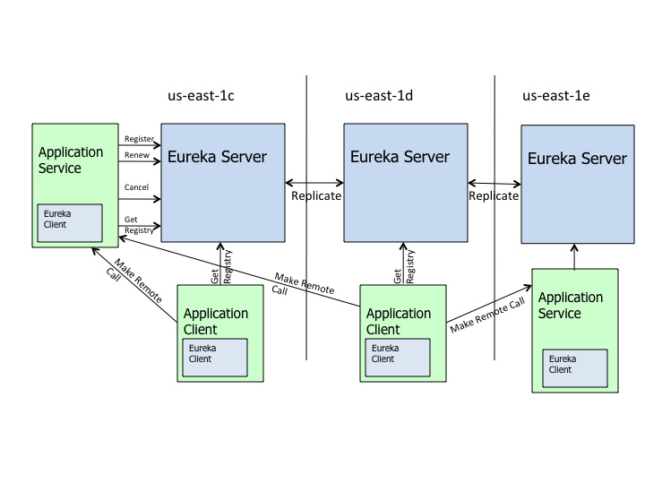

## CAP：  
    C:Consistency一致性。  
    A:Availability可用性。  
    P:Partition tolerance分区容错性。  
    
Zookeeper保证CP。  
Eureka保证AP。  

Eureka中的节点之间是相互平等的，部分注册中心的节点挂掉也不会对集群造成影响，即使集群只剩下一个节点存活也可以
正常提供发现服务。哪怕是所有的服务注册节点都挂了，Eureka Clients上也会缓存服务调用的信息，保证了微服务之间的互相调用是足够健壮的。

SpringCloudNetflix主要组件：Eureka、Ribbon、Hystrix、Feign等。

Eureka的集群不同于Zookeeper的选举leader的过程，EurekaServer采用的是Peer to Peer对等通信。这是一种去中心化的架构，无mater/slave区分，
每一个Peer都是对等的，节点通过彼此互相注册来提高可用性，每个节点需要添加一个或多个有效的serviceUrl指向其他节点，每个节点都可以认为是其他节点的副本。

EurekaServer对注册列表进行缓存，默认时间是30S。  
EurekaClient对获取到的注册信息进行缓存，默认时间是30S。  
Ribbon会从上面提到的EurekaClient获取服务列表，将负责均衡后的结果缓存30S。  

Ribbon：实现客户端的负载均衡。  
Hystrix：断路器。  
Feign：RESTful web service客户端，整合了Ribbon和Hystrix。  

    